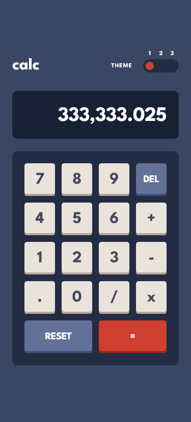
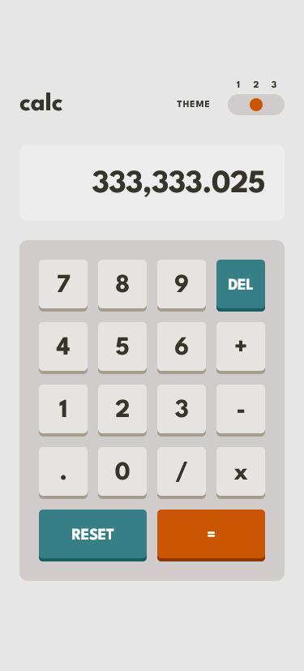
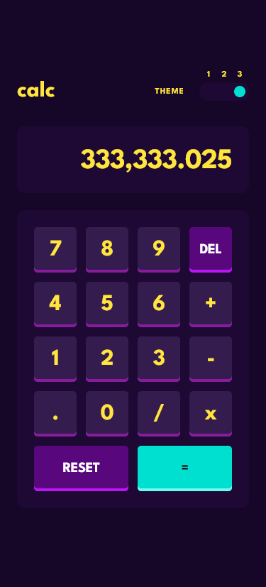
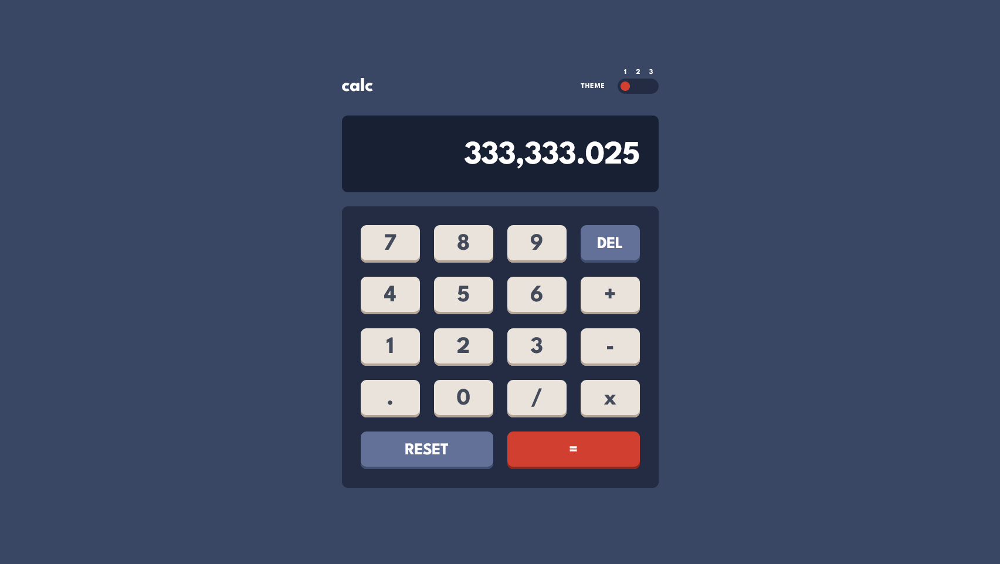
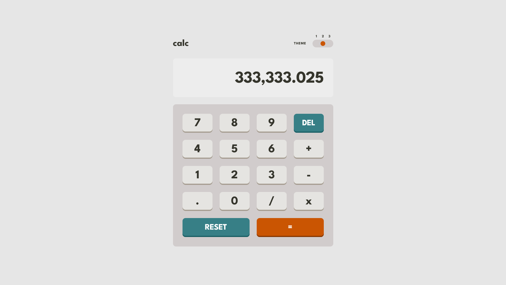
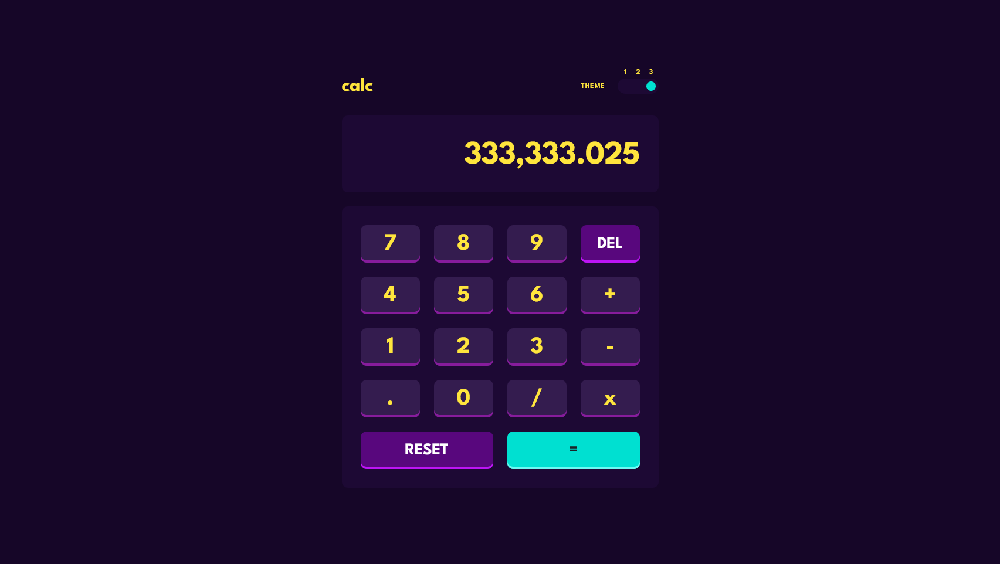

# Frontend Mentor - Calculator app solution

This is a solution to the [Calculator app challenge on Frontend Mentor](https://www.frontendmentor.io/challenges/calculator-app-9lteq5N29). Frontend Mentor challenges help you improve your coding skills by building realistic projects.

### Links

- Solution URL: [Frontend Mentor Solution Page](https://www.frontendmentor.io/solutions/calculator-app-0Va3JeLkz_)
- Live Site URL: [GitHub Pages Site](https://karolbanat.github.io/fem-calculator-app/)

## Author

- Frontend Mentor - [@karolbanat](https://www.frontendmentor.io/profile/karolbanat)

### Screenshot

